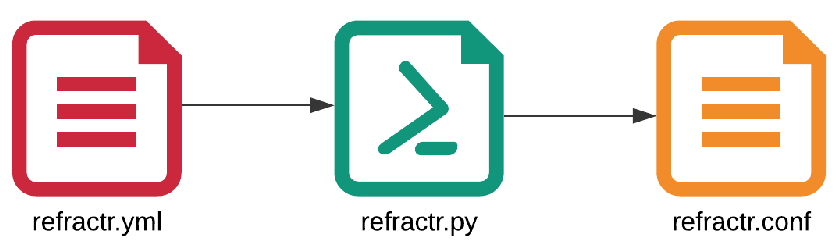

# Refractr Architecture
## Overview
Refractr was so named because ‘refract’ is to bend light to a new destination just as redirects and rewrites change the destination of a web request.  There are 200+ redirects|rewrites as is common with any company with a large web presence like Mozilla.  A marketing campaign secures a domain like firefoxcup2010.com, makes a website and promotes it.  After some time, the website is decommissioned.  Without any other change this would cause broken (404) web links on any of the websites that linked to that page.  The answer is redirects if simple enough and rewrites if more complex.  After time these build up to the numbers we have.  This problem will not go away but continue as we setup and shut down more websites.

## The Refractr Design Principles
* cloud-based solution
* reasonable cost to host our redirects|rewrites in the cloud
* use programmatically generated certificates that are compatible with the stack we're running on
* easy to add|modify redirect|rewrite without error
* testing of redirects|rewrites before deploying to prod
* minimal changes to configuration files will deploy all necessary changes to stage|prod env

### Cloud-based Solution
Refractr is a mozcloud tenant -- the application is deployed to GKE via Argo CD once built by GHA.

### Reasonable Cost to Host
Redirects and Rewrites are light on data but heavy on usage, so it is important to not have to pay per request.  Hosting the application as a Docker container running in a Kubernetes cluster is an efficient way to run this service.

### Automated certificate management
Refractr runs on GKE, requests are forwarded to the app by a GCP Loadbalancer instrumented through GCP's Gateway API controller. Certificates are managed with GCP's certificate manager API and mounted to the Loadbalancer through a certmap. Individual Certificates are programatically generated and renewed automatically.

### Easy to Add|Modify Redirect|Rewrite Without Error

Refractr makes it easy to edit redirects|rewrites by providing a simple yaml file spec that is converted into an Nginx conf file during Docker build.  The generated file is copied into the Docker image, however no code to make changes is included.  This is because the Docker container is an immutable, build-once, but never modify object in the spirit of [cattle not pets](https://devops.stackexchange.com/questions/653/what-is-the-definition-of-cattle-not-pets). Want to update the spec? Rebuild the container from the source code by pushing changes.

### Testing Redirects and Rewrites Prior to Deploying
The refractr.yml spec allows for specifying tests in the form of given-source to expected-destination for each redirect or rewrite specified. If no tests are specified for a redirect, they are generated from the src and dst fields. However, tests must be supplied for rewrites this is because the tests cannot be generated due to the complexity of regex. Testing is performed by running the built Docker container checking all of the source, destination combos either generated or specified from the refractr.yml. This step happens via CI along with **nginx -t** (test configuration) on every checkin.

### minimal changes
Due to the nature of redirects and rewrites it is common to add new domains or subtract old ones. This means that the nginx config needs to be told which are the valid list of domains and update them when deploying a new refractr Docker image to GKE. When a new version of the refractr image is pushed to prod, redirects are already live.

In a second step, certificates must be created and linked to refractr's Loadbalancer -- this step currently requires a second PR to be opened after deployment. All certificates are managed with GCP's certificate manager api and attached to the Loadbalancer by a certmap, we manage all of those resources via terraform in refractr's infrastructure project. 

## refractr traffic flow
Traffic flow to refractr starts with DNS. A domain that should be handled by the system must be pointed to it's Loadbalancer, usually by a CNAME, in some cases, by A / AAAA records. Once a request reaches the Loadbalancer, we force HTTPS, then forward to the actual application pods, which then handle individual redirects as configured.

## Continuous Integration (CI)
CI is done with GitHub Actions. Tests run on every push to any branch in the repo. However, only pushes to the **main** branch and **tags** (matching the `/v[0-9]+.[0-9]+.[0-9]+/`) will cause an update of refractr's Docker image. In addition to tests, Pull Requests (PRs) require code reviews before allowing the change to be to the **main** branch.

## The Handoff
The handoff point between CI and CD is the Docker Repository. In this case we decided to use the Cloud Provider based Docker Repository. For GCP that is Google Artifact Registry (GAR). Images are named refractr and have the output of git describe for the image tag. Image tags are watched and deployed by Argo CD.

## dependency managemnet
Refractr's dependencies are managed with [poetry](https://python-poetry.org/). In order to interact with the system locally, having poetry installed and setup is a requirement. Once tools are in place, a simple `$ poetry install` in the repo's base dir is enough to get started. From here on forward, `$ poetry shell` can be used to prepare your open shell session for interacting with the system directly. It is also possible to prepend commands with `$ poetry run`.

## Doit Automation (like Make)
The **mozilla-it/refractr** repository has a **dodo.py** ([doit](https://pydoit.org/)) that defines the list of tasks that can be performed. This approach was chosen to allow the developer to run the same automation at their desk as what is run during CI. This promotes tight feedback loops for the developers and confidence that once the changes are pushed they are most likely to succeed because they have already run them locally. Below is the output of the **doit list** command.

```sh
$ poetry run doit list
build                       run docker compose build for refractr
certificate_manager_input   create input file for certificate manager tf module
check                       run nginx -t test on refractr nginx config
deployed                    write refractr/deployed json file
drun                        run refractr container via docker compose up -d
nginx                       generate nginx.conf files from refractr.yml
refracts                    create refracts.json from loading refractr.yml
refractslisting             create refracts list  from loading refractr.json
schema                      test refractr.yml against schema.yml using jsonschema
show                        show CI variables
test                        run pytest tests against the locally running container
version                     write refractr/version json file
```

### deployed
The task generates the **deployed** json file with the values:
* **DEPLOYED_BY**
* **DEPLOYED_ENV**
* **DEPLOYED_WHEN**

### version
The task generates the version json file with the values:
* **BRANCH**
* **REVISION**
* **VERSION**

### schema
This task validates **refractr.yml** loaded into Python using [jsonschema](https://python-jsonschema.readthedocs.io/en/stable/) against the **schema.yml** ensuring that the entered specifications are correct.

### nginx
This task runs the **bin/refractr nginx** command to generate the **refractr.conf** file from the **refractr.yml** file. It will  be included in the Docker build image.  This task requires the following tasks to be completed successfully first:
* schema

### build
This task runs **docker compose build refractr**.  The Refractr Docker image that is produced has the refractr name and is tagged with the **git describe** output.  This task requires the following tasks to be completed successfully first:
* deployed
* version
* nginx

### check
This task runs **docker compose run refractr check (nginx -t)** to validate the veracity of the provided Nginx Configuration file ( **refractr.conf** ).  This task requires the following tasks to be completed successfully first:
* build

### drun
This task runs **docker compose up** to get a local Refractr Docker container running, required for testing. This is designed to work locally on the dev system as well in Github Actions. This task requires the following tasks to be complete successfully first:
* check

### show
This task shows the following CI environment variables and their values:
* **CI**
* **TAG**
* **VERSION**
* **BRANCH**
* **DEPLOYED_ENV**

### test
This task runs the tests specified in **test_refractr.py**.  This file itself generates a test for every redirect|rewrite found in the **refractr.yml** file. This task requires the following tasks to be completed successfully first:
* build
* drun

### certiticate_manager_input
This task generates a yaml document that is suitable for refractr's infrastructure terraform code. As mentioned above, we're managing certificates with GCP's certificate manager as of today, which is in turn instrumented via terraform. All certificates (and the certmap bundling them) is handled by a [terraform module](https://github.com/mozilla/terraform-modules/tree/main/google_certificate_manager_certificate_map). In refractr's infrastructure repository, output of this task is passed to the module.

## Refractr CLI
The **refractr cli** is an Argparse command tool to transform the **refractr.yml** to the **refractr.conf** (for nginx). This tool was written to print output of transformations to terminal.  This allows the user to "see" what the transformations will do.  The same fascilities will be used during the build of the docker image.  The help output is shown below will all of the subcommands described.
```
~/repos/mozilla-it/refractr > bin/refractr --help
usage: refractr [-h] [-c CFG] [-o OUPUT] {show,sh,domains,do,certificate_manager_input,cmi,nginx,ngx,ingress,ing,validate,val} ...

refractr

options:
  -h, --help            show this help message and exit
  -c CFG, --config CFG  default="dev-refractr.yml"; specify the config yaml to use
  -o OUPUT, --output OUPUT
                        default="yaml"; set the output type; choices=[json, yaml]

action:
  {show,sh,domains,do,certificate_manager_input,cmi,nginx,ngx,ingress,ing,validate,val}
                        actions
    show (sh)           show data transformed by loading
    domains (do)        show domains in selected spec
    certificate_manager_input (cmi)
                        print domains in certificate manager module compatible format
    nginx (ngx)         generate nginx
    ingress (ing)       generate ingress
    validate (val)      validate refracts <public|localhost|stage>
```

### show
The refractr.yml allows several different formats for a refract specification.  However, after loaded from the yaml file the data structure is normalized.  This command shows that normalized structure.  This command is *not* used during build, but rather a helpful debug tool for the developer.

### domains
This command is also *not* used during the build, but it is helpful to visualize the total domains and their count in the spec file.

### nginx
This is the main command that converts refracts specified in the **refractr.yaml** to nginx blocks in refractr.conf.  Because this happens happens at Docker build time, to change the redirects|rewrites, you have to change the refracts in the yaml file and build a new Docker image.

### validate
This is a very helpful debug tool that allows you to test the redirects|rewrites.  It uses the tests generated or specified in the refract and "tests" by checking each hop for the location and the http code.  Note sometimes, the refract specifies an endpoint that is further redirected.  This should be evident in the out from the validate command.  Note: the code that performs these hops and checks is the same used in the tests.

## Health Checks and Information
The Refractr service provides two endpoints for getting information on the deployed code.

## /deployed
Performing a web request to the **/deployed** endpoint for the Refractr service will provide 3 data:
* **DEPLOYED_BY** will give the username and email address that deployed the application
* **DEPLOYED_ENV** will be the **prod** or **stage** environment
* **DEPLOYED_WHEN** will be the UTC timestamp when the code was deployed

## /version
Performing a web request to the **/version** endpoint for the Refractr service will provide 3 data:
* **BRANCH** will supply the branch that was deployed
* **REVISION** will supply the SHA1 hash for the git commit that was deployed
* **VERSION** will supply the **git describe** output used for the container tag
