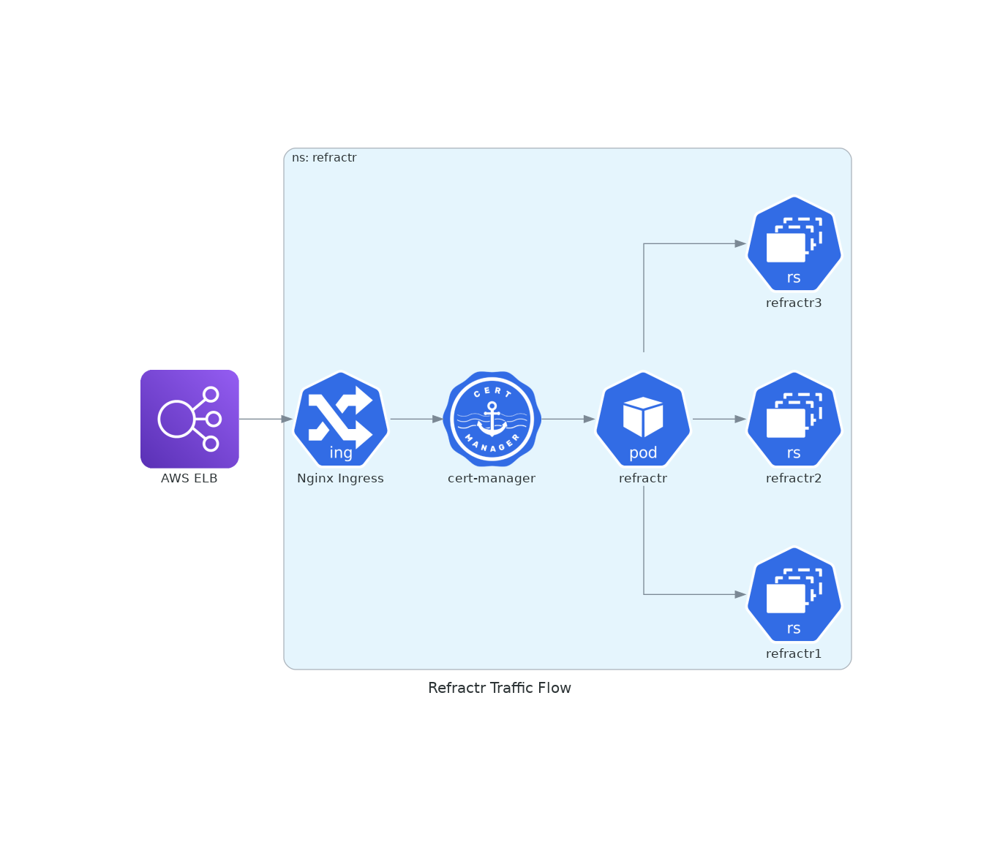
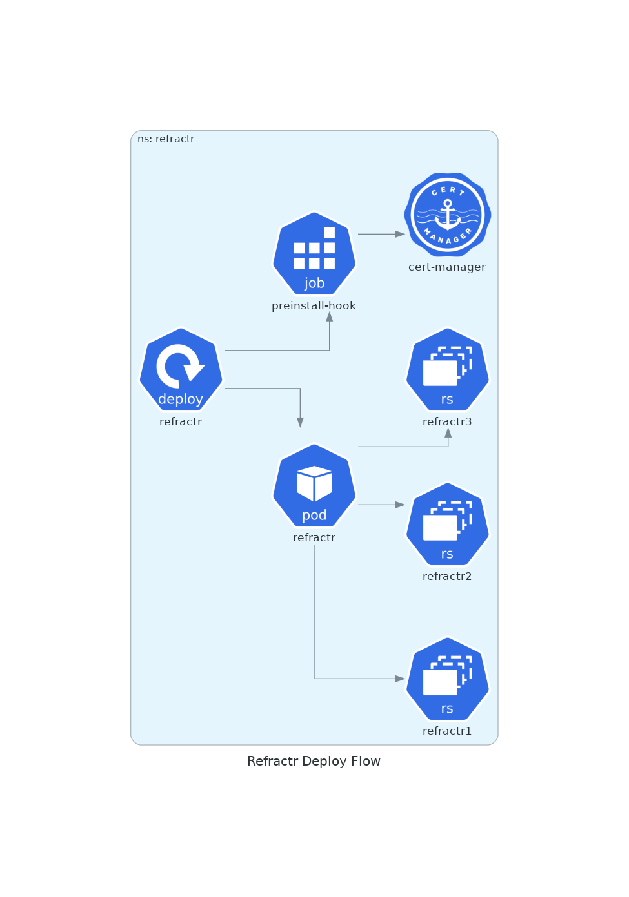

# Refractr Architecture
## Overview
Refractr was so named because ‘refract’ is to bend light to a new destination just as redirects and rewrites change the destination of a web request.  There are 200+ redirects|rewrites as is common with any company with a large web presence like Mozilla.  A marketing campaign secures a domain like firefoxcup2010.com, makes a website and promotes it.  After some time, the website is decommissioned.  Without any other change this would cause broken (404) web links on any of the websites that linked to that page.  The answer is redirects if simple enough and rewrites if more complex.  After time these build up to the numbers we have.  This problem will not go away but continue as we setup and shut down more websites.

## Current Solution
The current solution is an Apache file that is served by VM in the datacenter along with a Zeus LoadBalancer pointing to it.  This giant apache file (~2800 lines), is deployed via Puppet with several minutes of a commit to the ‘master’ branch.  There is not a working stage environment.  So multiple fiddly commits to the main branch are required every time.  There is no testing suite, so that is done manually *after* deploying to production. Not to mention many of the domains for the redirects have DigiCert SSL cert that can cost up to $140 dollars per year.  This requires ongoing maintenance and unnecessary cost to the organization.

## The Refractr Design Principles
* cloud-based solution
* reasonable cost to host our redirects|rewrites in the cloud
* use Let’s Encrypt SSL certificates instead of DigiCert
* easy to add|modify redirect|rewrite without error
* testing of redirects|rewrites before deploying to prod
* single change to configuration file will deploy all necessary changes to stage|prod env

### Cloud-based Solution
We chose to deploy this in our AWS accounts, in an EKS Kubernetes cluster that houses other IT Web SRE applications (prod|stage).

### Reasonable Cost to Host
Redirects and Rewrites are light on data but heavy on usage, so it is important to not have to pay per request.  Hosting the application as a Docker container running in a Kubernetes cluster is an efficient way to run this service.

### Use Let’s Encrypt Certificates Instead of DigiCert
With the availability of free SSL certificates like LE or ACM, there is no reason to be paying for DigiCert certificates for domains to redirect or rewrite.  The Nginx ingress kubernetes allows for Cert Manager to automatically handle the renewal of LE certificates every 60 days.

### Easy to Add|Modify Redirect|Rewrite Without Error

Refractr makes it easy to edit redirects|rewrites by providing a simple yaml file spec that is converted into an Nginx conf file during Docker build.  The generated file is copied into the Docker image, however no code to make changes is included.  This is because the Docker container is an immutable, build-once, but never modify object in the spirit of [cattle not pets](https://devops.stackexchange.com/questions/653/what-is-the-definition-of-cattle-not-pets). Want to update the spec? Rebuild the container from the source code by pushing changes.

### Testing Redirects and Rewrites Prior to Deploying
The refractr.yml spec allows for specifying tests in the form of given-source to expected-destination for each redirect or rewrite specified. If no tests are specified for a redirect, they are generated from the src and dst fields. However, tests must be supplied for rewrites this is because the tests cannot be generated due to the complexity of regex. Testing is performed by running the built Docker container checking all of the source, destination combos either generated or specified from the refractr.yml. This step happens via CI along with **nginx -t** (test configuration) on every checkin.

### Single Change to Refractr.yml Spec Deploys All Changes
Due to the nature of redirects and rewrites it is common to add new domains or subtract old ones.  This means that the Nginx ingress needs to be told which are the valid list of domains and update them when deploying a new Refractr Docker image to the Kubernetes cluster.  This is handled in a similar manner to how the **refractr.conf**, Nginx configuration file, is generated at build time.  In this case the ingress.yaml file is generated from the refractr.yml AND the ingress.yaml.template file to produce the ingress.yaml that is built into the container.  During deployment into the Kubernetes cluster, **kubectl apply -f ingress.yaml** is run in a container once. This is what ensures that k8s specification for the domains and SSL certificates for the Nginx Ingress is updated to reflect the “single change” to the source code.  Without this, it would require to separate, manual steps to effect the appropriate change.

Note that the same Refractr container is used in both of these contexts.
* The container running the refractr redirect|rewrite service
* Also this one time configuration for the Nginx Ingress

## Refractr Traffic Flow

The traffic flow for Refractr starts with DNS for all of the domains pointing to the ELB.  From there the Nginx ingress forwards to cert-manager to handled all of the LE certs.  From there it is onto the Refractr Service which connects to the Refractr pods with the Nginx containers (with the refractr.conf) to handle all of the redirects and rewrites specified therein.  From there it is off to other destinations in the internet (where the refractrs specify).

## Continuous Integration (CI)
The CI system used for Refractr is Github Actions. Tests are run on every push to any branch in the repo. However, only pushes to the **main** branch and **tags** with `/v[0-9]+.[0-9]+.[0-9]+/` pattern get published to the Docker Repository (ECR), mentioned below. In addition to tests, Pull Requests (PRs) require code reviews before allowing the change to be to the **main** branch.

## The Handoff
The handoff point between CI and CD is the Docker Repository. In this case we decided to use the Cloud Provider based Docker Repository. For AWS that is Elastic Container Registry (ECR).  Images are named refractr and have the output of git describe for the image tag.  All of the images pushed to the main branch get published to the ECR in the same AWS account that contains the Kubernetes (EKS) cluster.  This means permissions to deploy the container into the cluster are not an issue. Note: All ECR repositories have the [Image Scanning](https://docs.aws.amazon.com/AmazonECR/latest/userguide/image-scanning.html) turned on to prevent the leakage of credentials or secrets.

## Continuous Delivery (CD)

Refractr supports Continuous Delivery via FluxCD. Every commit pushed to the main branch on the mozilla-it/refractr repository is published to the ECR repository. A regex that determines the difference between stage and prod images.
* **stage** images have Docker image tags (git describe) with the commits-since notation as well as the first 7 of the Git SHA1 hash after the letter **g**.  For example **v0.0.7-4-gb1ff42b** reads as **4** commits since the **v0.0.7** tag and first **7** of the *g*it sha1 is **b1ff42b**
* **prod** images have the image tags (git describe) with *only* the tag symver values.  Example **v0.0.7**

This allows the SRE to promote the commit that has been deployed to stage to prod by simple git tagging and pushing to the github repository. This will cause tests to run again. if successful, to publish to the ECR repository with only the semver tag for the Docker image tag.  The [FluxCD Git Operator](https://www.weave.works/technologies/gitops/) will poll to find new images and deploy this to the prod Kubernetes cluster.

## Doit Automation (like Make)
The **mozilla-it/refractr** repository has a **dodo.py** ([doit](https://pydoit.org/)) that defines the list of tasks that can be performed. This approach was chosen to allow the developer to run the same automation at their desk as what is run during CI. This promotes tight feedback loops for the developers and confidence that once the changes are pushed they are most likely to succeed because they have already run them locally.  Below is the output of the **doit list** command.  Note: this requires to be logged into the correct AWS account via **maws**.
```
~/repos/mozilla-it/version > doit list
build      run docker-compose build for refractr
check      run nginx -t test on refractr nginx config
creds      verify the appropriate creds are present
deployed   write refractr/deployed json file
drun       run refractr container via docker-compose up -d
ingress    create ingress.yaml from refractr.yml,ingress.yaml.template
login      perform ECR docker login via AWS perms
nginx      generate nginx.conf files from refractr.yml
publish    publish docker image to aws ECR
schema     test refractr.yml against schema.yml using jsonschema
show       show CI variables
test       run pytest tests against the locally running container
version    write refractr/version json file
```
### creds
This task runs aws **get-caller-identity** to validate correct **maws** login creds.

### deployed
The task generates the **deployed** json file with the values:
* **DEPLOYED_BY**
* **DEPLOYED_ENV**
* **DEPLOYED_WHEN**

### version
The task generates the version json file with the values:
* **BRANCH**
* **REVISION**
* **VERSION**

### schema
This task validates **refractr.yml** loaded into Python using [jsonschema](https://python-jsonschema.readthedocs.io/en/stable/) against the **schema.yml** ensuring that the entered specifications are correct.

### nginx
This task runs the **bin/refractr nginx** command to generate the **refractr.conf** file from the **refractr.yml** file. It will  be included in the Docker build image.  This task requires the following tasks to be completed successfully first:
* schema

### ingress
This task runs the **bin/refractr ingress** command to generate the **ingress.yaml** file from the **refractr.yml** and **ingress.yaml.template** files. It will  be included in the Docker build image.  This task requires the following tasks to be completed successfully first:
* schema

### build
This task runs **docker-compose build refractr**.  The Refractr Docker image that is produced has the refractr name and is tagged with the **git describe** output.  This task requires the following tasks to be completed successfully first:
* deployed
* version
* creds
* nginx
* ingress

### check
This task runs **docker-compose run refractr check (nginx -t)** to validate the veracity of the provided Nginx Configuration file ( **refractr.conf** ).  This task requires the following tasks to be completed successfully first:
* creds
* build

### drun
This task runs **docker-compose up** to get a local Refractr Docker container running, required for testing. This is designed to work locally on the dev system as well in Github Actions. This task requires the following tasks to be complete successfully first:
* creds
* check

### show
This task shows the following CI environment variables and their values:
* **CI**
* **TAG**
* **VERSION**
* **BRANCH**
* **DEPLOYED_ENV**

### test
This task runs the tests specified in **test_refractr.py**.  This file itself generates a test for every redirect|rewrite found in the **refractr.yml** file. This task requires the following tasks to be completed successfully first:
* build
* drun

### login
This task runs **aws ecr get-login-password** and **docker login** to be authorized to publish Docker images to the ECR repository. This task requires the following tasks to be completed successfully first:
* FIXME

### publish
This task runs **docker tag refractr:<git describe output>** and **docker push** to the ECR repository. This task requires the following tasks to be completed successfully first:
* creds
* tests
* login

## Refractr CLI
The **refractr cli** is an Argparse command tool to transform the **refractr.yml** to the **refractr.conf** (for nginx) and **ingress.yaml** (for cert-manager|ingress). This tool was written to print output of transformations to terminal.  This allows the user to "see" what the transformations will do.  The same fascilities will be used during the build of the docker image.  The help output is shown below will all of the subcommands described.
```
~/repos/mozilla-it/refractr > bin/refractr --help
usage: refractr [-h] [-c CFG]
                {show,sh,domains,do,nginx,ngx,ingress,ing,validate,val} ...

refractr

optional arguments:
  -h, --help            show this help message and exit
  -c CFG, --config CFG  default="./refractr/refractr.yml"; specify the config
                        yaml to use

action:
  {show,sh,domains,do,nginx,ngx,ingress,ing,validate,val}
                        actions
    show (sh)           show data transformed by loading
    domains (do)        show domains in selected spec
    nginx (ngx)         generate nginx
    ingress (ing)       generate ingress
    validate (val)      validate refracts <public|localhost|stage>
```
### show
The refractr.yml allows several different formats for a refract specification.  However, after loaded from the yaml file the data structure is normalized.  This command shows that normalized structure.  This command is *not* used during build, but rather a helpful debug tool for the developer.

### domains
This command is also *not* used during the build, but it is helpful to visualize the total domains and their count in the spec file.

### nginx
This is the main command that converts refracts specified in the **refractr.yaml** to nginx blocks in refractr.conf.  Because this happens happens at Docker build time, to change the redirects|rewrites, you have to change the refracts in the yaml file and build a new Docker image.

### ingress
This is the secondary command that creates an **ingress.yaml** file from the template and **refractr.yml** file.  This is needed to setup the cert-manager with the list of domains so that it can request an LE cert for each of them.

### validate
This is a very helpful debug tool that allows you to test the redirects|rewrites.  It uses the tests generated or specified in the refract and "tests" by checking each hop for the location and the http code.  Note sometimes, the refract specifies an endpoint that is further redirected.  This should be evident in the out from the validate command.  Note: the code that performs these hops and checks is the same used in the tests.

## Health Checks and Information
The Refractr service provides two endpoints for getting information on the deployed code.

## /deployed
Performing a web request to the **/deployed** endpoint for the Refractr service will provide 3 data:
* **DEPLOYED_BY** will give the username and email address that deployed the application
* **DEPLOYED_ENV** will be the **prod** or **stage** environment
* **DEPLOYED_WHEN** will be the UTC timestamp when the code was deployed

## /version
Performing a web request to the **/version** endpoint for the Refractr service will provide 3 data:
* **BRANCH** will supply the branch that was deployed
* **REVISION** will supply the SHA1 hash for the git commit that was deployed
* **VERSION** will supply the **git describe** output used for the container tag

